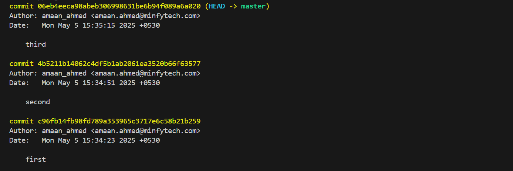

## git log history
06eb4ee third
4b5211b second
c96fb14 first
2542f0d final commit
7b6eb92 screenshot added successfully
0bd5689 Four Doors
903f847 Freely Three
c0ecfa2 Two in a row
2d97724 One Done

## git diff between HEAD & HEAD~1
git diff HEAD HEAD~1
diff --git a/p1 b/p1
index d82a09a..601c1e2 100644
--- a/p1
+++ b/p1
@@ -1,4 +1,5 @@
 Gravity was discovered by Isaac Newton
 Bulb was invented by Thomas Alva Edison
 Telephone was invented by Alexander Graham Bell
+AT&T was started by himself
 Watch was invented by Peter Henlein
\ No newline at end of file

## git log screenshot

## Explanation of the things
created a file and wrote four lines 
initialized git with local repo
added the file into it and commited with first message
next added some text and repeated the third line.
edited the text and repeated the third line.
after all the different changes in file dived into git log 
took a screenshot of it
uploaded screenshot of commit history to README file.
pushed the information of git log to README file
uploaded the git difference between the first commit and second commit