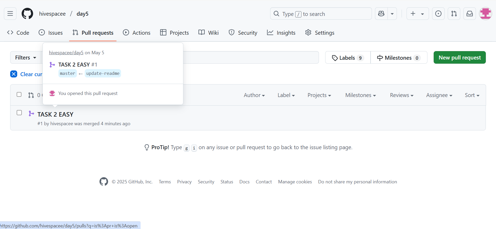

## git log history 
06eb4ee third 
4b5211b second 
c96fb14 first 
2542f0d final commit 
7b6eb92 screenshot added successfully 
0bd5689 Four Doors 
903f847 Freely Three 
c0ecfa2 Two in a row 
2d97724 One Done  

## git diff between HEAD & HEAD~1 
git diff HEAD HEAD~1 
diff --git a/p1 b/p1 
index d82a09a..601c1e2 100644 
--- a/p1 
+++ b/p1 
@@ -1,4 +1,5 @@ 
 Gravity was discovered by Isaac Newton 
 Bulb was invented by Thomas Alva Edison 
 Telephone was invented by Alexander Graham Bell 
+AT&T was started by himself 
 Watch was invented by Peter Henlein 
\ No newline at end of file  

## git log screenshot 
  

## Explanation of the things 
Created a file and wrote four lines 
Initialized git with local repo 
Added the file into it and committed with first message 
Next, added some text and repeated the third line. 
Edited the text and repeated the third line. 
After all the different changes in file, dived into git log 
Took a screenshot of it 
Uploaded screenshot of commit history to README file. 
Pushed the information of git log to README file 
Uploaded the git difference between the first commit and second commit  

## Changes 
These are the characters made for changes done for task 2 from easy category  

## Screenshot for pull requests 
 
